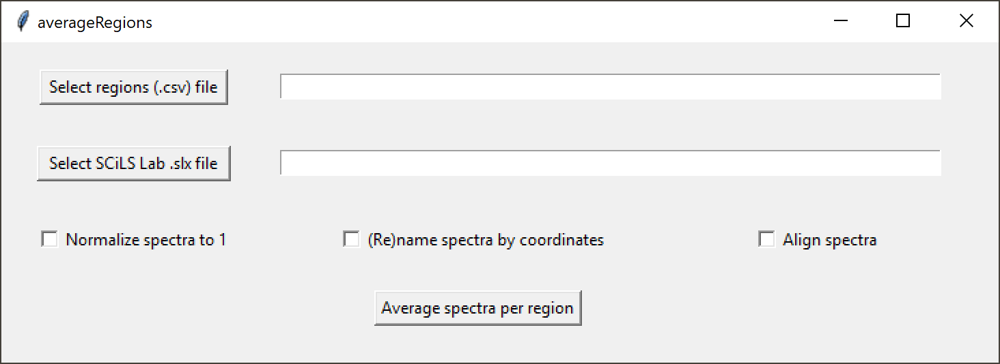

# averageRegions
averageRegions averages the spectra in defined regions in a SCiLS Lab dataset.

[1. Introduction](#1-Introduction)  
&nbsp;&nbsp;&nbsp;&nbsp;&nbsp;[1.1 What is averageRegions?](#11-What-is-averageRegions)  
&nbsp;&nbsp;&nbsp;&nbsp;&nbsp;[1.2 What can averageRegions be used for?](#12-What-can-averageRegions-be-used-for)  
[2. Installing averageRegions](#2-Installing-averageRegions)  
&nbsp;&nbsp;&nbsp;&nbsp;&nbsp;[2.1 Running averageRegions](#21-Running-averageRegions)  
&nbsp;&nbsp;&nbsp;&nbsp;&nbsp;[2.2 Running averageRegions from within RStudio](#22-Running-averageRegions-from-within-RStudio)  
[3. Using averageRegionss](#3-Using-averageRegions)  
&nbsp;&nbsp;&nbsp;&nbsp;&nbsp;[3.1 Selecting the regions file](#31-Selecting-the-regions-file)  
&nbsp;&nbsp;&nbsp;&nbsp;&nbsp;[3.2 Selecting the SCiLS Lab dataset](#32-Selecting-the-SCiLS-Lab-dataset)  
&nbsp;&nbsp;&nbsp;&nbsp;&nbsp;[3.3 Normalization](#33-Normalization)  
&nbsp;&nbsp;&nbsp;&nbsp;&nbsp;[3.4 Renaming regions](#34-Renaming-regions)  
&nbsp;&nbsp;&nbsp;&nbsp;&nbsp;[3.5 Aligning spectra](#35-Aligning-spectra)  
[4. Acknowledgements ](#4-Acknowledgements)  
[5. Further reading](#5-Further-reading)  

## 1. Introduction

### 1.1 What is averageRegions?

averageRegions (aligns and) averages the spectra in all or a defined subset of regions in a SCiLS Lab dataset and outputs this a Bruker-style .xy file.

### 1.2 What can averageRegions be used for?

averageRegions automates the otherwise labor intensive process of creating average spectra and exporting these in ASCII (.xy) format for all or a defined subset of regions in a SCiLS Lab dataset, and (optionally) automatically naming the exported spectra from region coordinates. By default, the spectra are exported to new files in the same folder as the original SCiLS Lab dataset.

## 2. Installing averageRegions

To install averageRegions, simply download the R script and place it in an arbitrary folder, e.g. ```C:\Program Files\SCiLS Lab tools\averageRegions``` on a Windows system. Create a batch (.bat) file calling the R program with ```Rscript.exe``` for a version of R currently installed on your system that is compatible with the SCiLS Lab R API, e.g. R-4.1.2:

```
@echo off
"C:\Program Files\R\R-4.1.2\bin\Rscript.exe" "C:\Program Files\SCiLS Lab tools\averageRegions\averageRegions.R"
pause
```

If making a shortcut to this batch file, you can change its properties to run in "minimized" mode. This will automatically hide the command line interface, which is only used for debugging and troubleshooting by averageRegions.

### 2.1 Running averageRegions

To run averageRegions, simply launch the software by running the batch file or double-clicking on the shortcut. The first time averageRegions is run, any necessary R libraries will be installed. This may require manual removal of some lock files from previous R package installations.


### 2.2 Running averageRegions from within RStudio

It is also possible to run averageRegions from within RStudio. Simply launch RStudio and open the R script. Remember to use the same version of R compatible with the SCiLS Lab API. However, averageRegions is designed to be run from its graphical user interface, hiding the complexity of the R code from the user.


## 3. Using averageRegions

averageRegions has a clean graphical user interface (GUI):



Tooltips provide additional cues on the different elements of the GUI. Hover with the mouse pointer over a button to see what action it will trigger.

### 3.1 Selecting the regions file

Click on the "Select regions (.csv) file" button and select the CSV file defining and naming the regions for which you wish to calculate and export aveage spectra. Technically, these files are not comma-separated, but rather uses semicolons as the field separators.

### 3.2 Selecting the SCiLS Lab dataset

Next, click on the "Select SCiLS Lab .slx file" button and navigate to the SCiLS Lab dataset (SLX file). Make sure the actual data (SBD file) is in the same directory. Make sure the settings (checkboxes) are correct and click on "Average spectra from regions" to export the average spectra in the defined regions in the SCiLS Lab dataset. After completion, averageRegions will automatically close, to release the SCiLS Lab software license and the lock on the SCiLS Lab files. The SLX file can now be opened in SCiLS Lab proper.

### 3.3 Normalization

To express all spectra as a fraction of the total intensity in the region, check the "Normalize spectra" box. This divides the intensities of each peak in the average spectrum with the total intensity in the region.

### 3.4 Renaming regions

If no output names are provided in the feature (CSV) file, averageRegions will still average the regions, and use the name of the region as the output filename. To instead use the average coordinate as the output filename, click the "(Re)name features by coordinates" box. This will override any names provided in the CSV file.

### 3.5 Aligning spectra

To use a custom alignment algorithm optimized for high-resolution spectra before averaging spectra, check the "Align spectra" box.


## 4. Acknowledgements

The developer wish to thank Rob Marissen for help and support during the development of averageRegions.


## 5. Further reading

averageRegions has not been described or used in any publications as yet.

